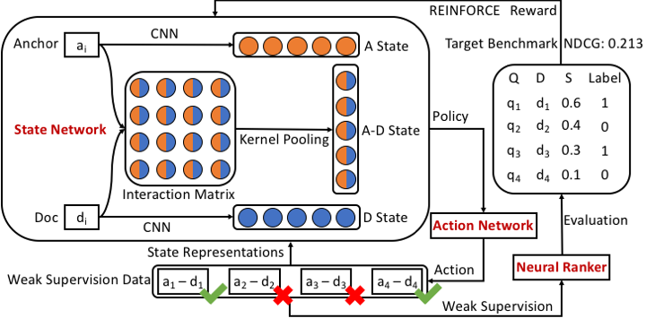

# ReInfoSelect
Code and dataset of WWW2020 Paper **Selective Weak Supervision for Neural Information Retrieval**. [Paper](https://arxiv.org/pdf/2001.10382.pdf)

## Datasets
Coming soon.

## References
- [End-to-end neural ad-hoc ranking with kernel pooling](http://www.cs.cmu.edu/afs/cs/user/cx/www/papers/K-NRM.pdf) (K-NRM)
- [Convolutional Neural Networks for Soft-Matching N-Grams in Ad-hoc Search](http://www.cs.cmu.edu/~zhuyund/papers/WSDM_2018_Dai.pdf) (Conv-KNRM)
- [TU Wien @ TREC Deep Learning ?~@~Y19 ?~@~S Simple Contextualization for Re-ranking](https://arxiv.org/pdf/1912.01385.pdf) (TK)
- [Entity-Duet Neural Ranking: Understanding the Role of Knowledge Graph Semantics in Neural Information Retrieval](https://www.aclweb.org/anthology/P18-1223.pdf) (EDRM)
- [BERT: Pre-training of Deep Bidirectional Transformers for Language Understanding](https://arxiv.org/pdf/1810.04805.pdf) (BERT)

## Contact
If you have questions, suggestions and bug reports, please email zkt18@mails.tsinghua.edu.cn.
